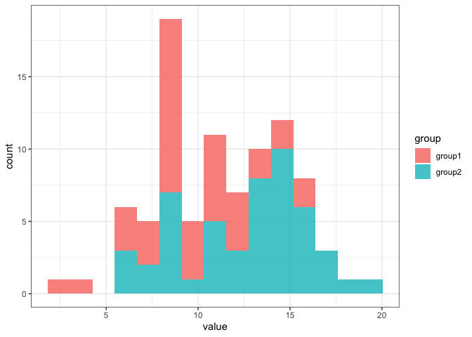
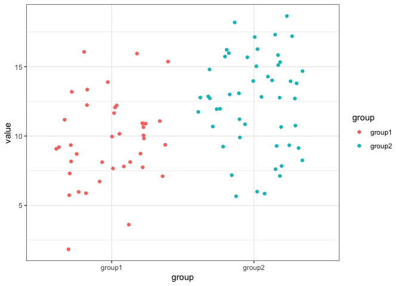

# mcpwr

<!-- badges: start -->

<!-- badges: end -->

The goal of mcpwr is to perform Monte Carlo power calculations

## Installation

You can install the development version of mcpwr from
[GitHub](https://github.com/) with:

``` r
# install.packages("devtools")
devtools::install_github("TJMurphy/mcpwr")
```

## Example

The poisdm function is a datamaker for data with a Poisson distribution

``` r
library(mcpwr)

# generate data and graphs
# for group 1 (group of 40 measurements with a mean of 10)
# and group 2 (group of 50 with measurements with a mean of 12)

poisdm(c(40, 50), c(10, 12), c("group1", "group2"))
```



    #> [1] "input"
    #>   groupnames  n lambda
    #> 1     group1 40     10
    #> 2     group2 50     12
